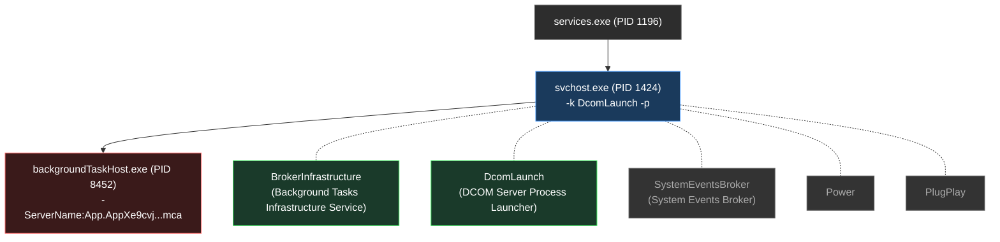
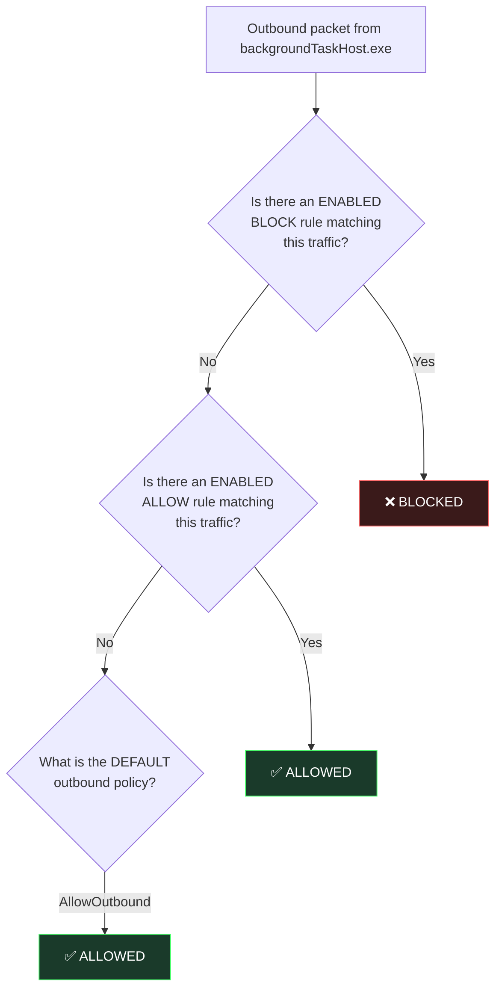

# Investigation: backgroundTaskHost.exe → 23.7.129.5

## 1. The Connection — WHAT

| Field | Value |
|---|---|
| **Local Endpoint** | `192.168.3.38:57584` |
| **Remote Endpoint** | `23.7.129.5:443` (HTTPS/TLS) |
| **State** | `ESTABLISHED` |
| **Owning PID** | `8452` |
| **Connection Created** | `4/23/2026 9:27:24 PM` |
| **Remote Host** | `a23-7-129-5.deploy.static.akamaitechnologies.com` |
| **Remote Owner** | `AS16625 Akamai Technologies, Inc.` — El Segundo, California, US |

> [!NOTE]
> **23.7.129.5** is an **Akamai CDN edge node**. Microsoft heavily uses Akamai to serve Windows Store content, app updates, and catalog data. This is a standard Microsoft content-delivery path — not a direct Microsoft server.

---

## 2. The Process — WHO is Connected

| Field | Value |
|---|---|
| **PID** | `8452` |
| **Binary** | `C:\WINDOWS\system32\backgroundTaskHost.exe` |
| **Command Line** | `"C:\WINDOWS\system32\backgroundTaskHost.exe" -ServerName:App.AppXe9cvj1thv1hmcw0cs98xm3r97tyzy2xs.mca` |
| **Started** | `4/22/2026 9:55:48 AM` |
| **Uptime** | ~1.5 days |
| **CPU Used** | 2.86 seconds total (negligible) |
| **Working Set** | 85.73 MB |
| **Threads** | 7 |
| **Handles** | 626 |
| **Signature** | ✅ **Valid** — signed by `CN=Microsoft Windows` (Microsoft Windows Production PCA 2011) |

### Loaded DLLs from WindowsApps (the smoking gun):

```
C:\Program Files\WindowsApps\Microsoft.WindowsStore_22603.1401.9.0_x64__8wekyb3d8bbwe\WinStore.App.dll
C:\Program Files\WindowsApps\Microsoft.WindowsStore_22603.1401.9.0_x64__8wekyb3d8bbwe\e_sqlite3.DLL
```

> [!IMPORTANT]
> The app behind this `backgroundTaskHost.exe` instance is **Microsoft Windows Store** (`Microsoft.WindowsStore` v22603.1401.9.0). The loaded `WinStore.App.dll` confirms this definitively. The connection to Akamai over HTTPS is the Store performing background catalog sync / update checks.

---

## 3. The Process Chain — HOW It Was Spawned



### Step-by-step chain:

1. **`services.exe` (PID 1196)** — The Windows Service Control Manager (boot process)
2. **`svchost.exe` (PID 1424)** — Hosts the `-k DcomLaunch` service group. This single svchost hosts **5 services**:
   - **`BrokerInfrastructure`** — Background Tasks Infrastructure Service
   - **`DcomLaunch`** — DCOM Server Process Launcher
   - `SystemEventsBroker` — System Events Broker
   - `Power`
   - `PlugPlay`
3. **`backgroundTaskHost.exe` (PID 8452)** — The out-of-process COM host for the Windows Store background task

> [!NOTE]
> Both `BrokerInfrastructure` and `DcomLaunch` share PID 1424. They are co-located in the same svchost process. `BrokerInfrastructure` decides *when* to trigger a background task; `DcomLaunch` handles the *how* (COM activation of the new process).

---

## 4. WHY — The Purpose of the Connection

The **Microsoft Windows Store** registers multiple background task extensions in its manifest:

| Task Type | Trigger | Purpose |
|---|---|---|
| `systemEvent` | System state changes | React to network availability, user login, package updates |
| `timer` | Periodic schedule | Periodic catalog refresh, update polling |
| `systemEvent + timer` | Combined | Ensure update checks happen both on schedule and when conditions change |

**The connection to Akamai CDN (23.7.129.5:443)** is the Store's background task performing one or more of:
- **App update polling** — checking if installed apps have available updates
- **Store catalog sync** — refreshing app metadata, pricing, featured content
- **License validation** — periodic license/entitlement checks for installed apps
- **Content delivery** — downloading small assets or metadata from the CDN

This is **expected behavior** for a Windows system with the Microsoft Store installed.

---

## 5. WHEN — Timeline

| Event | Timestamp |
|---|---|
| `services.exe` started | 4/21/2026 1:58:45 AM (boot) |
| `svchost.exe -k DcomLaunch` started | 4/21/2026 1:58:45 AM (boot) |
| `backgroundTaskHost.exe` spawned | 4/22/2026 9:55:48 AM (~32 hours after boot) |
| TCP connection to 23.7.129.5 established | 4/23/2026 9:27:24 PM (~1.5 days after process start) |

> [!NOTE]
> The process was spawned ~32 hours after boot (likely triggered by a timer or system event). The specific TCP connection was created ~1.5 days after the process spawned. The process has used only 2.86 seconds of CPU over its entire lifetime — consistent with an idle background task that wakes periodically.

---

## 6. Verification of Gemini's Explanation

Gemini claimed:
> *"BrokerInfrastructure manages background tasks for UWP apps. When a registered task is triggered, it signals DCOMLaunch to spin up an out-of-process COM server. DCOMLaunch does this by executing `backgroundTaskHost.exe`, passing the specific App ID as the `-ServerName` argument."*

### Verdict: ✅ CONFIRMED (with nuances)

| Claim | Evidence | Status |
|---|---|---|
| BrokerInfrastructure manages background tasks for UWP apps | Service `BrokerInfrastructure` ("Background Tasks Infrastructure Service") runs in PID 1424 alongside DcomLaunch | ✅ Confirmed |
| It signals DCOMLaunch to spin up a COM server | Both services share PID 1424 (same svchost group `-k DcomLaunch`). Parent PID of backgroundTaskHost.exe is 1424. | ✅ Confirmed |
| DCOMLaunch executes `backgroundTaskHost.exe` | Parent of PID 8452 is PID 1424 which hosts DcomLaunch | ✅ Confirmed |
| Passes App ID as `-ServerName` argument | Command line: `-ServerName:App.AppXe9cvj1thv1hmcw0cs98xm3r97tyzy2xs.mca` | ✅ Confirmed |
| The specific ServerName is `App.AppXe9cvj1thv1hmcw0cs98xm3r97tyzy2xs.mca` | Exact match in WMI `Win32_Process.CommandLine` | ✅ Confirmed |

> [!TIP]
> **Nuance**: Gemini's explanation is accurate but slightly simplified. `BrokerInfrastructure` and `DcomLaunch` are tightly coupled — they co-exist in the same svchost process. The "signaling" between them is an intra-process call, not an inter-process RPC. The broker infrastructure determines the trigger condition is met, then hands off to the DCOM activation machinery which is right there in the same process.

---

## 7. How to Investigate `App.AppXe9cvj1thv1hmcw0cs98xm3r97tyzy2xs.mca`

This is the most nuanced part. Here's a complete methodology:

### 7a. Understanding the Naming Convention

The `-ServerName` argument follows this structure:

```
App.AppX<hash>.mca
│    │         │
│    │         └── "Microsoft COM Activation" — suffix for COM activation
│    │
│    └── SHA256-derived hash of the package identity
│        (NOT the PublisherId — this is a common misconception)
│
└── The Application ID from AppxManifest.xml (the <Application Id="App"> node)
```

> [!WARNING]
> **The hash `e9cvj1thv1hmcw0cs98xm3r97tyzy2xs` is NOT the package's PublisherId.** The Windows Store's PublisherId is `8wekyb3d8bbwe`. This hash is a **synthetic COM ProgID** that Windows generates internally when registering UWP background tasks in the COM activation catalog. It is derived from a hash of the full package identity (name + publisher + version + architecture), making it opaque by design.

### 7b. Investigation Methodology (Step-by-Step)

#### Method 1: Loaded DLLs (Most Reliable — what we used)
```powershell
# Get the PID from netstat
$pid = (Get-NetTCPConnection -RemoteAddress "23.7.129.5").OwningProcess

# List all DLLs loaded from WindowsApps
Get-Process -Id $pid | Select-Object -ExpandProperty Modules |
    Where-Object { $_.FileName -like "*WindowsApps*" } |
    Select-Object FileName
```
**Result**: This immediately revealed `WinStore.App.dll` from `Microsoft.WindowsStore_22603.1401.9.0_x64__8wekyb3d8bbwe`

#### Method 2: PowerShell AppX Package Search
```powershell
# Search by PublisherId (if you knew it)
Get-AppxPackage | Where-Object { $_.PublisherId -eq "8wekyb3d8bbwe" }

# Search all packages for background task extensions
Get-AppxPackage | ForEach-Object {
    $pkg = $_
    $manifest = Join-Path $_.InstallLocation "AppxManifest.xml"
    if (Test-Path $manifest) {
        [xml]$xml = Get-Content $manifest
        $xml.Package.Applications.Application | ForEach-Object {
            if ($_.Id -eq "App") {
                [PSCustomObject]@{
                    PackageName = $pkg.Name
                    PFN = $pkg.PackageFamilyName
                    HasBackgroundTasks = ($_.Extensions.Extension | Where-Object { $_.Category -eq "windows.backgroundTasks" }) -ne $null
                }
            }
        }
    }
} | Where-Object { $_.HasBackgroundTasks }
```

#### Method 3: Process Monitor (Sysinternals)
```
1. Download ProcMon from Sysinternals
2. Filter: Process Name = backgroundTaskHost.exe
3. Filter: Operation = Process Create
4. Watch for the -ServerName argument and correlate with loaded DLLs
```

#### Method 4: Registry Deep-Dive
```powershell
# The COM activation catalog lives in multiple registry hives:
# Per-machine activatable classes
reg query "HKLM\SOFTWARE\Microsoft\Windows\CurrentVersion\AppModel\StateRepository\Cache\Application" /s /f "WindowsStore" | Select-Object -First 20

# Check the package state repository (SQLite DB)
# Located at: C:\ProgramData\Microsoft\Windows\AppRepository\StateRepository-Machine.srd
```

#### Method 5: Event Viewer
```powershell
# Check Application log for background task registration
Get-WinEvent -FilterHashtable @{
    LogName = 'System'
    ProviderName = 'Microsoft-Windows-DistributedCOM'
} -MaxEvents 20 | Where-Object { $_.Message -like "*AppX*" }
```

### 7c. Why Direct Registry Lookup Failed

The hash `e9cvj1thv1hmcw0cs98xm3r97tyzy2xs` is **not stored as-is** in the traditional `HKLM\SOFTWARE\Classes\AppID` or `HKCR\CLSID` registry paths. This is because:

1. **UWP COM registration is virtualized** — UWP apps register COM classes through their AppxManifest.xml, not through traditional registry entries
2. **The activation catalog is managed by the State Repository** — a SQLite database at `C:\ProgramData\Microsoft\Windows\AppRepository\StateRepository-Machine.srd`
3. **The hash is computed at registration time** by the Deployment Engine and stored in the State Repository, not in the classical COM registry hives

---

## 8. Threat Assessment

| Indicator | Assessment |
|---|---|
| Binary signature | ✅ Valid Microsoft signature |
| Binary location | ✅ `C:\WINDOWS\system32\` (protected by TrustedInstaller) |
| Parent process | ✅ `svchost.exe -k DcomLaunch` (standard Windows service host) |
| Grandparent process | ✅ `services.exe` (Windows SCM) |
| Remote IP | ✅ Akamai CDN (standard Microsoft content delivery) |
| Remote port | ✅ 443 (HTTPS — encrypted) |
| Loaded DLLs | ✅ Microsoft Windows Store components |
| CPU usage | ✅ 2.86s over 1.5 days (minimal — consistent with idle background task) |
| Memory | ⚠️ 85.73 MB (moderate, but normal for a Store process with loaded catalog data) |

> [!TIP]
> **Verdict: BENIGN.** This is a standard Microsoft Windows Store background task performing content synchronization via Akamai CDN. All indicators are consistent with legitimate Windows behavior. No signs of hijacking, injection, or anomalous activity.

---

## 9. Summary of Answers

| Question | Answer |
|---|---|
| **WHAT** | `backgroundTaskHost.exe` hosting a Windows Store background task, connected over HTTPS to Akamai CDN |
| **HOW** | `BrokerInfrastructure` triggered the task → `DcomLaunch` activated it via COM → spawned `backgroundTaskHost.exe` with the Store's synthetic COM ServerName |
| **WHY** | Windows Store periodic background sync — app update checks, catalog refresh, license validation |
| **WHEN** | Process spawned 4/22 9:55 AM (32hrs after boot); TCP connection created 4/23 9:27 PM |
| **WHO** | Microsoft Windows Store (`Microsoft.WindowsStore_22603.1401.9.0_x64__8wekyb3d8bbwe`) — signed by Microsoft |

---

## 10. Firewall Bypass Analysis — HOW It Connects Despite Firewall Rules

### What the firewall rules show

| Rule | Direction | Action | **Enabled** |
|---|---|---|---|
| Microsoft Store | Outbound | Allow | ❌ **FALSE** (disabled) |
| Microsoft Store | Inbound | Allow | ❌ **FALSE** (disabled) |

The explicit "Microsoft Store" allow rules are **DISABLED**. So how does it connect?

### The answer: Default Outbound Policy is `AllowOutbound`

```
Domain Profile:   Firewall Policy = BlockInbound, AllowOutbound
Private Profile:  Firewall Policy = BlockInbound, AllowOutbound
Public Profile:   Firewall Policy = BlockInbound, AllowOutbound
```

> [!IMPORTANT]
> **The Windows Firewall default policy allows ALL outbound traffic.** The disabled "Microsoft Store" rules are irrelevant because the default outbound action is `Allow`. The firewall only blocks **inbound** connections by default. Outbound connections from ANY process — including `backgroundTaskHost.exe` — pass through unless there is an explicit **enabled** `Block` rule targeting them.

### Why the disabled rules don't matter

The Windows Firewall evaluates rules in this order:



**Result**: No enabled block rules exist for this traffic → falls through to default policy → `AllowOutbound` → connection permitted.

### Additional bypass: UWP Capabilities

The Windows Store declares these network capabilities in its manifest:

| Capability | Effect |
|---|---|
| `internetClientServer` | Full internet client + server access |
| `privateNetworkClientServer` | Local network access |
| `runFullTrust` | **Run outside the UWP sandbox** — bypasses app container network restrictions |
| `networkConnectionManagerProvisioning` | Can provision network connections |
| `unvirtualizedResources` | Access resources without virtualization |
| `extendedBackgroundTaskTime` | Background tasks can run for extended periods |

> [!WARNING]
> The `runFullTrust` capability is the most significant. It means the Windows Store's background task host runs with **full trust**, not in an app container. This means the WFP (Windows Filtering Platform) app container isolation — which normally restricts UWP apps to only the network capabilities they declare — does **not apply**. The process has the same network access as any traditional desktop application.

### How to actually block it

To prevent `backgroundTaskHost.exe` from connecting outbound, you would need to:

```powershell
# Option 1: Create an explicit ENABLED block rule for the program
New-NetFirewallRule -DisplayName "Block backgroundTaskHost Outbound" `
    -Direction Outbound -Action Block -Enabled True `
    -Program "C:\WINDOWS\system32\backgroundTaskHost.exe"

# Option 2: Change the default outbound policy to Block (CAUTION: breaks many things)
# Set-NetFirewallProfile -DefaultOutboundAction Block

# Option 3: Block the specific remote IP
New-NetFirewallRule -DisplayName "Block Akamai CDN" `
    -Direction Outbound -Action Block -Enabled True `
    -RemoteAddress "23.7.129.5"
```

> [!CAUTION]
> Blocking `backgroundTaskHost.exe` outbound will break ALL UWP background tasks, not just the Store. Option 3 (blocking the specific IP) is more targeted but Akamai IPs rotate frequently.

---

## 11. Network Anomaly — Connection During "No Internet"

### The timeline correlation

| Timestamp | Event |
|---|---|
| `4/23/2026 9:27:24 PM` | **TCP connection to 23.7.129.5 established** (from `Get-NetTCPConnection.CreationTime`) |
| `4/23/2026 9:27:24 PM` | **Network State Change Fired** — `NetworkConnectivityLevelChanged: true` |
| `4/23/2026 9:29:40 PM` | Another Network State Change — connectivity level changed again |
| `4/23/2026 9:35:09 PM` | Another Network State Change — connectivity level changed again |

> [!IMPORTANT]
> **The TCP connection was established at the EXACT SAME SECOND as a network connectivity state change event.** This is the key to understanding the "no internet" paradox.

### Explanation: The Connection Was Made During a Connectivity Transition

Here's what happened:

1. **Before 9:27:24 PM**: Your system may have been in a state where Windows classified the network as having limited/no internet connectivity (e.g., the Network Location Awareness service hadn't completed its probe to `www.msftconnecttest.com`).

2. **At 9:27:24 PM**: A **network connectivity level change** occurred. This means the physical link was up (Ethernet connected at 1 Gbps) and TCP/IP was functional, but Windows was in the process of reclassifying the connection.

3. **The TCP stack doesn't care about Windows' "connectivity level"**. The TCP/IP stack operates at a lower level than the Network Location Awareness (NLA) service. As long as:
   - The network adapter is `Up`
   - An IP address is assigned (`192.168.3.38`)
   - A route to the destination exists
   - The gateway is reachable
   
   ...then TCP connections **can be established**, regardless of whether Windows *reports* "Internet" or "No Internet" in the system tray.

4. **The Windows Store's background task uses `SystemEvent` triggers** — one of which is `InternetAvailable`. When the network state changed, `BrokerInfrastructure` likely fired the background task trigger, and the Store immediately attempted its CDN connection. The TCP handshake completed successfully because the physical path was functional, even though NLA may not have completed its connectivity probe yet.

### The key insight

```
┌─────────────────────────────────────────────────────────┐
│              Layer Stack at 9:27:24 PM                  │
├─────────────────────────────────────────────────────────┤
│  NLA (Network Location Awareness)  →  "Checking..."    │
│  Windows UI                        →  "No Internet"    │
├─────────────────────────────────────────────────────────┤
│  TCP/IP Stack                      →  FULLY FUNCTIONAL │
│  Network Adapter                   →  UP, 1 Gbps       │
│  Physical Link                     →  Connected        │
└─────────────────────────────────────────────────────────┘

  backgroundTaskHost.exe operates HERE ──┘
  (TCP layer, not the UI layer)
```

> [!TIP]
> **"No Internet" in Windows is a UI-level classification, not a network-level reality.** The NLA service performs an HTTP probe to `www.msftconnecttest.com/connecttest.txt` to determine internet connectivity. During the window between physical link-up and NLA probe completion, TCP connections can succeed while Windows still reports "No Internet." The Store's background task is specifically designed to fire on network state changes, making it one of the first things to connect during this transition window.

### Additional evidence: Frequent network state changes

Your event log shows **8 network state changes** on 4/23 alone:

| Time | Event |
|---|---|
| 8:35:47 AM | NetworkConnectivityLevelChanged |
| 10:52:19 AM | NetworkConnectivityLevelChanged |
| 10:59:32 AM | NetworkConnectivityLevelChanged |
| 11:09:09 AM | NetworkConnectivityLevelChanged |
| 11:14:54 AM | NetworkConnectivityLevelChanged |
| 11:16:24 AM | NetworkConnectivityLevelChanged |
| **9:27:24 PM** | **NetworkConnectivityLevelChanged** ← connection established here |
| 9:29:40 PM | NetworkConnectivityLevelChanged |
| 9:35:09 PM | NetworkConnectivityLevelChanged |

This pattern of frequent connectivity level changes could indicate:
- Intermittent ISP issues
- Router/gateway instability
- DNS resolution failures affecting NLA probes
- Or simply Windows periodically re-evaluating connectivity status

Each of these transitions is an opportunity for the Store's `SystemEvent` background task to fire and attempt a connection.
